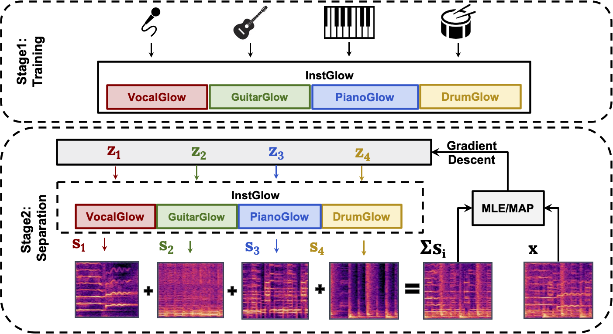

# 
Music Source Separation with Generative Flow

Ge Zhu1, Jordan Darefsky1, Fei Jiang2, Anton Selitskiy1, and Zhiyao Duan1

1AIRLab (University of Rochester), 2XX

## Abstract

 Full supervision models for source separation are trained on mixture-source parallel data and have achieved superior performance in recent years. However, large-scale and naturally mixed parallel training data are difficult to obtain for music, and such models are difficult to adapt to mixtures with new sources. Source-only supervision models, in contrast, only require clean sources for training; They learn source models and then apply these models to separate the mixture. In this paper, we leverage flow-based implicit generators to train music source priors and likelihood-based objectives to separate music mixtures. Experiments show that in singing voice separation and music separation tasks, our proposed approach achieves competitive performance to one of the full supervision systems. We also demonstrate that our approach is capable of separating new source tracks without the need of retraining the separation model from scratch as what full supervision models do. 
 

 

 

<table align="center">
  <thead>
    <tr>
      <th> </th>
      <th>Vocal</th>
      <th>Bass</th>
      <th>Drums</th>
      <th>Other</th>
    </tr>
  </thead>
  <tbody>
    <tr>
      <th>Groun Truth</th>
      <td><audio controls="" preload="auto">
            <source src="demo/GT/vocals_cut.wav"></audio></td>
      <td><audio controls="" preload="auto">
            <source src="demo/GT/bass_cut.wav"></audio></td>
      <td><audio controls="" preload="auto">
            <source src="demo/GT/drums_cut.wav"></audio></td>
      <td><audio controls="" preload="auto">
            <source src="demo/GT/other_cut.wav"></audio></td>
    </tr>
    <tr>
      <th>Openunmix</th>
      <td><audio controls="" preload="auto">
            <source src="demo/openunmix/1_vocals_22k_cut.wav"></audio></td>
      <td><audio controls="" preload="auto">
            <source src="demo/openunmix/1_bass_22k_cut.wav"></audio></td>
      <td><audio controls="" preload="auto">
            <source src="demo/openunmix/1_drums_22k_cut.wav"></audio></td>
      <td><audio controls="" preload="auto">
            <source src="demo/openunmix/1_other_22k_cut.wav"></audio></td>
    </tr>
    <tr>
      <th>Demucs</th>
      <td><audio controls="" preload="auto">
            <source src="demo/demucs/vocals_22k_cut.wav"></audio></td>
      <td><audio controls="" preload="auto">
            <source src="demo/demucs/bass_22k_cut.wav"></audio></td>
      <td><audio controls="" preload="auto">
            <source src="demo/demucs/drums_22k_cut.wav"></audio></td>
      <td><audio controls="" preload="auto">
            <source src="demo/demucs/other_22k_cut.wav"></audio></td>
    </tr>
    <tr>
      <th>Waveunet</th>
      <td><audio controls="" preload="auto">
            <source src="demo/waveunet/mixture-1_vocals_22k_cut.wav"></audio></td>
      <td><audio controls="" preload="auto">
            <source src="demo/waveunet/mixture-1_bass_22k_cut.wav"></audio></td>
      <td><audio controls="" preload="auto">
            <source src="demo/waveunet/mixture-1_drums_22k_cut.wav"></audio></td>
      <td><audio controls="" preload="auto">
            <source src="demo/waveunet/mixture-1_other_22k_cut.wav"></audio></td>
    </tr>
    <tr>
      <th>Tasnet</th>
      <td><audio controls="" preload="auto">
            <source src="demo/tasnet/vocals_22k_cut.wav"></audio></td>
      <td><audio controls="" preload="auto">
            <source src="demo/tasnet/bass_22k_cut.wav"></audio></td>
      <td><audio controls="" preload="auto">
            <source src="demo/tasnet/drums_22k_cut.wav"></audio></td>
      <td><audio controls="" preload="auto">
            <source src="demo/tasnet/other_22k_cut.wav"></audio></td>
    </tr>
    <tr>
      <th>InstGlow</th>
      <td><audio controls="" preload="auto">
            <source src="demo/instGlow/vocals_cut.wav"></audio></td>
      <td><audio controls="" preload="auto">
            <source src="demo/instGlow/bass_cut.wav"></audio></td>
      <td><audio controls="" preload="auto">
            <source src="demo/instGlow/drums_cut.wav"></audio></td>
      <td><audio controls="" preload="auto">
            <source src="demo/instGlow/other_cut.wav"></audio></td>
    </tr>
  </tbody>
</table>
