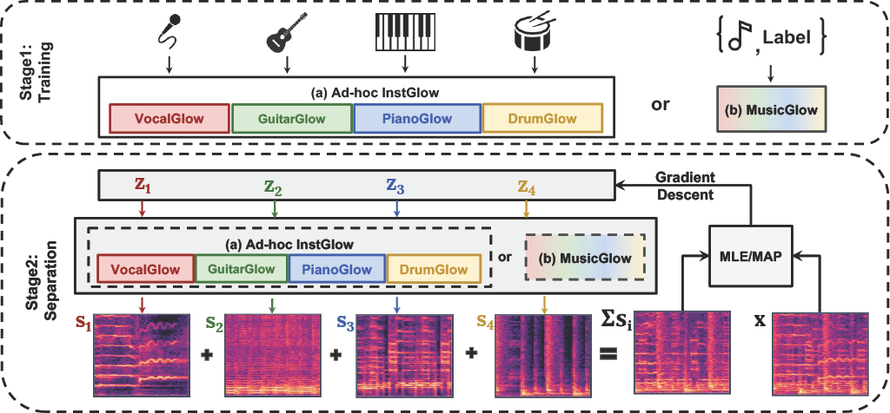

# 
Music Source Separation with Generative Flow

Ge Zhu1, Jordan Darefsky1, Fei Jiang2, Anton Selitskiy1, and Zhiyao Duan1

1AIRLab (University of Rochester), 2XX

## Abstract

 Music source separation under full supervision,
where paired mixed signals and source signals are both available,
has obtained substantial progress over the years. However, this
setting highly relies on large amounts of paired data. Source-only
supervision, on the other hand, decouples the process of learning
a mapping from a mixture to particular sources into a two
stage paradigm: source modeling and separation. Recent systems
under source-only supervision either achieve good performance
in synthetic toy experiments or limited performance in music
separation task. In this paper, we leverage flow based generators
to train music source priors and likelihood based objective to
separate music mixtures. Experiments show that in both singing
voice and music separation tasks in MUSDB18 dataset, our
proposed systems achieve competitive results to one of the full
supervision systems. We also demonstrate one variant of our
proposed systems is capable of separating new source tracks
effortlessly.
 

 

 

<table align="center">
  <thead>
    <tr>
      <th> </th>
      <th>Vocal</th>
      <th>Bass</th>
      <th>Drums</th>
    </tr>
  </thead>
  <tbody>
    <tr>
      <th>Groun Truth</th>
      <td><audio controls="" preload="auto">
            <source src="demo/GT/vocals.wav"></audio></td>
      <td><audio controls="" preload="auto">
            <source src="demo/GT/bass.wav"></audio></td>
      <td><audio controls="" preload="auto">
            <source src="demo/GT/drums.wav"></audio></td>
      <td><audio controls="" preload="auto">
            <source src="demo/GT/other.wav"></audio></td>
    </tr>
    <tr>
      <th>Openunmix</th>
      <td><audio controls="" preload="auto">
            <source src="demo/openunmix/1_vocals_22k.wav"></audio></td>
      <td><audio controls="" preload="auto">
            <source src="demo/openunmix/1_bass_22k.wav"></audio></td>
      <td><audio controls="" preload="auto">
            <source src="demo/openunmix/1_drums_22k.wav"></audio></td>
      <td><audio controls="" preload="auto">
            <source src="demo/openunmix/1_other_22k.wav"></audio></td>
    </tr>
    <tr>
      <th>Demucs</th>
      <td><audio controls="" preload="auto">
            <source src="demo/demucs/vocals_22k.wav"></audio></td>
      <td><audio controls="" preload="auto">
            <source src="demo/demucs/bass_22k.wav"></audio></td>
      <td><audio controls="" preload="auto">
            <source src="demo/demucs/drums_22k.wav"></audio></td>
      <td><audio controls="" preload="auto">
            <source src="demo/demucs/other_22k.wav"></audio></td>
    </tr>
    <tr>
      <th>Waveunet</th>
      <td><audio controls="" preload="auto">
            <source src="demo/waveunet/mixture-1_vocals_22k.wav"></audio></td>
      <td><audio controls="" preload="auto">
            <source src="demo/waveunet/mixture-1_bass_22k.wav"></audio></td>
      <td><audio controls="" preload="auto">
            <source src="demo/waveunet/mixture-1_drums_22k.wav"></audio></td>
      <td><audio controls="" preload="auto">
            <source src="demo/waveunet/mixture-1_other_22k.wav"></audio></td>
    </tr>
    <tr>
      <th>Tasnet</th>
      <td><audio controls="" preload="auto">
            <source src="demo/tasnet/vocals_22k.wav"></audio></td>
      <td><audio controls="" preload="auto">
            <source src="demo/tasnet/bass_22k.wav"></audio></td>
      <td><audio controls="" preload="auto">
            <source src="demo/tasnet/drums_22k.wav"></audio></td>
      <td><audio controls="" preload="auto">
            <source src="demo/tasnet/other_22k.wav"></audio></td>
    </tr>
    <tr>
      <th>InstGlow</th>
      <td><audio controls="" preload="auto">
            <source src="demo/instGlow/vocals.wav"></audio></td>
      <td><audio controls="" preload="auto">
            <source src="demo/instGlow/bass.wav"></audio></td>
      <td><audio controls="" preload="auto">
            <source src="demo/instGlow/drums.wav"></audio></td>
      <td><audio controls="" preload="auto">
            <source src="demo/instGlow/other.wav"></audio></td>
    </tr>
  </tbody>
</table>
